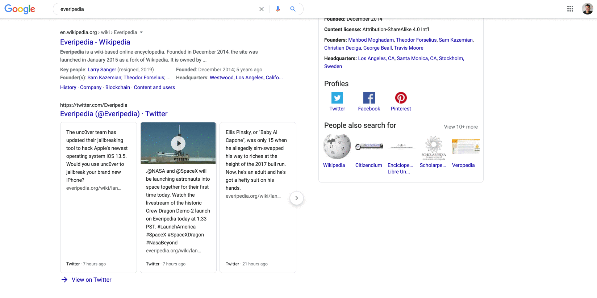

  

    <b>A Browser Extension to see Everipedia instead of Wikipedia</b>

 
 
 

 

## 🛠 Installation

1. Clone this repository or [download it as a zip](https://github.com/EveripediaNetwork/everipedia-always/archive/master.zip) then unzip
1. Open Brave or Chrome 
1. Go to 'Extensions' (`chrome://extensions/`)
1. Enable 'Developer mode'
1. Click 'Load unpacked extension'
1. Select this repository from your filesystem

 

## 👨🏻‍💻 Coming Soon

1. Publish to the Chrome store
2. Support all languages (ko.everipedia.org, es.everipedia.org, and zh.everipedia.org)
